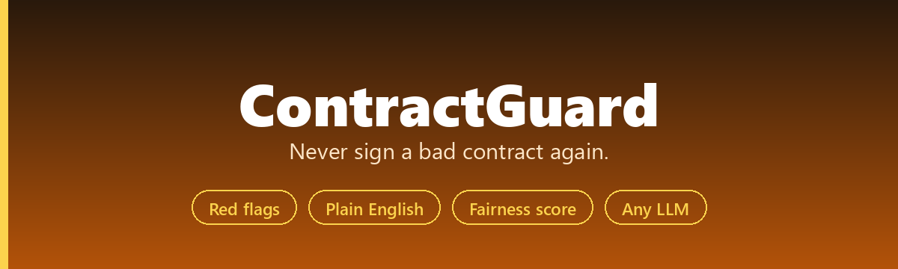
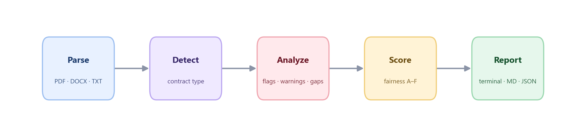

<div align="center">



上传任意合同 → 秒级识别霸王条款、不公平条款，用大白话解释给你听。

[](https://pypi.org/project/contractguardian/)
[](LICENSE)
[](https://www.python.org/downloads/)
[](https://github.com/he-yufeng/ContractGuard/actions)

**[English](README.md) · [中文](README_CN.md)** &nbsp;·&nbsp; [效果演示](#效果演示) · [快速上手](#快速上手) · [工作原理](#工作原理)

</div>

---

## 为什么做 ContractGuard？

每年有数百万人签下自己并不真正理解的合同 — 租房合同里藏着天价违约金，劳动合同里的竞业禁止范围大到离谱，保密协议悄悄剥夺你的权利。请律师审合同要 300-500 元/小时。大多数人的选择是：闭眼签字，祈祷没坑。

**ContractGuard** 改变了这一切。它是一个开源 AI Agent，能读完合同里的每一条每一款，用大白话标出问题，告诉你该怎么谈判 — 整个过程不到 30 秒。

**和直接丢给 ChatGPT 有什么不同？**
- **结构化分析**，不是一大段文字 — 你会得到分类好的红旗警告、注意事项、保护条款和公平性评分
- **每个问题都有可操作的建议** — 不只是说"这不好"，而是告诉你"改成这样"
- **一致的输出格式**（Pydantic 模型）— 方便集成到其他工具
- **CLI 优先** — 一条命令，漂亮的终端输出，不需要打开浏览器
- **支持任何 LLM** — OpenRouter、OpenAI、Ollama（完全本地/隐私）

## 效果演示

```bash
contractguard scan 租房合同.pdf
```

```
✔ 已解析 租房合同.pdf（4,521 字符）

⬤ 红旗警告（发现 5 项）
==================================================

  1. 押金不退
     条款：第三条
     "押金不予退还，合同终止时由出租方保留"
     大部分地区法规要求押金可退。此条款可能违法。
     建议：删除"不予退还"表述。

  2. 房东可随时进入无需通知
     条款：第五条
     "出租方有权随时进入房屋，无需提前通知"
     法律通常要求提前 24 小时书面通知。
     建议：增加"需提前 24 小时书面通知"

  … 还有 3 项红旗、3 项注意、2 项保护、4 项缺失保护 …

公平性评分: D (28/100)
  5 项红旗  3 项注意  2 项保护  4 项缺失
```

## 快速上手

### 1. 安装

```bash
pip install contractguardian
```

### 2. 配置 API Key

ContractGuard 兼容任何 OpenAI 协议的 API，选一种即可：

**方式 A：OpenRouter（推荐）** — 一个 key 访问 Claude、GPT-4、DeepSeek、Gemini 等 100+ 模型：

```bash
export OPENROUTER_API_KEY=sk-or-...
```

**方式 B：直接用 OpenAI：**

```bash
export OPENAI_API_KEY=sk-...
export OPENAI_BASE_URL=https://api.openai.com/v1
```

**方式 C：本地模型（Ollama）** — 合同数据完全不出本机：

```bash
export OPENAI_BASE_URL=http://localhost:11434/v1
export OPENAI_API_KEY=ollama
```

### 3. 扫描合同

```bash
contractguard scan 合同.pdf
```

三步搞定，60 秒以内。

## 用法详解

```bash
# 扫描 PDF、DOCX 或 TXT
contractguard scan lease.pdf

# 指定任意 OpenRouter / OpenAI / Ollama 模型
contractguard scan contract.pdf --model openai/gpt-4o

# 导出 Markdown 报告，或结构化 JSON 供脚本使用
contractguard scan contract.pdf --output report.md
contractguard scan contract.pdf --json --output report.json

# 扫描整个文件夹，或对比两个版本的合同
contractguard batch ./contracts/ --output-dir reports/
contractguard compare lease-v1.pdf lease-v2.pdf
```

### Python API

```python
from contractguard.analyzer import analyze_contract
from contractguard.parser import extract_text

result = analyze_contract(extract_text("租房合同.pdf"))
print(f"{result.fairness_grade} ({result.fairness_score}/100)")
for flag in result.red_flags:
    print(f"- {flag.title}（{flag.clause}）：{flag.suggestion}")
```

`--json` 会输出完整的结构化结果（合同类型、当事人、关键条款、红旗、注意事项、保护条款、公平性评分），基于 Pydantic 模型，方便 pipe 给其他工具。

## 支持的文件格式

| 格式 | 扩展名 | 说明 |
|------|--------|------|
| PDF | `.pdf` | 文字型 PDF。扫描件/图片型 PDF 需要 OCR（即将支持） |
| Word | `.docx` | Microsoft Word 文档 |
| 纯文本 | `.txt` | 纯文本文件 |
| Markdown | `.md` | Markdown 文件 |
| 富文本 | `.rtf` | Rich Text Format 文件 |

## 支持的合同类型

ContractGuard 自动识别合同类型并针对性分析。每种类型有特定的红旗项和行业标准保护条款：

| 合同类型 | ContractGuard 检查的内容 |
|---|---|
| **租赁合同** | 租金涨幅、押金可退性、维修义务、房东出入权、提前解约罚金、居住适宜性保证 |
| **保密协议（NDA）** | "保密信息"范围是否过宽、期限、竞业限制/禁止挖角、已有知识排除、资料归还/销毁 |
| **劳动合同** | 竞业禁止范围和期限、知识产权归属（公司是否拥有你的业余项目？）、解约通知期、遣散费、试用期条款 |
| **自由职业/外包合同** | 付款条款和周期、终止费、知识产权归属、赔偿条款、范围蔓延保护、逾期付款违约金 |
| **SaaS 服务条款** | 数据所有权和可迁移性、自动续费和取消、SLA 保证、责任限制、单方面修改权 |
| **贷款合同** | 利率（固定/浮动）、提前还款违约金、违约触发条件、个人担保范围、抵押要求 |
| **买卖合同** | 保修条款、退换货政策、责任上限、争议解决方式（仲裁 vs 法院）、不可抗力 |

## 工作原理



1. **解析** — 从文档中提取文本。PDF 使用 `pdfplumber` 处理复杂排版，DOCX 使用 `python-docx` 读取所有段落。

2. **识别** — 将提取的文本发送到 LLM，自动识别合同类型（租赁、NDA、劳动合同等），并调整分析策略。

3. **分析** — AI Agent 逐条审查每个条款，将发现分为四类：
   - **红旗警告** — 可能造成经济损失、法律责任或权益丧失的严重问题。签字前必须争取修改。
   - **注意事项** — 值得协商但不至于致命的中等问题。很多合同里都有，但你应该知情。
   - **保护条款** — 保护你利益的好条款。合同做对的地方。
   - **缺失保护** — 标准合同中应有但缺失的条款。缺失可能让你暴露在风险中。

4. **评分** — 生成公平性等级，从 A+（优秀，双方公平）到 F（严重偏向一方，多项红旗）。评分基于发现问题的数量和严重程度，与现有保护条款做平衡。

5. **报告** — 输出 Rich 格式的终端美化报告，或导出 Markdown/JSON 以便分享或进一步处理。

## 配置

### LLM 服务商

ContractGuard 使用 OpenAI 兼容 API 格式，几乎支持所有 LLM 服务商：

| 服务商 | 配置方式 | 适用场景 |
|--------|---------|---------|
| **OpenRouter** | `export OPENROUTER_API_KEY=sk-or-...` | 一个 key 访问 100+ 模型 |
| **OpenAI** | `export OPENAI_API_KEY=sk-...` + `export OPENAI_BASE_URL=https://api.openai.com/v1` | 直接使用 GPT-4o、o1 等 |
| **Anthropic（通过 OpenRouter）** | 使用 `--model anthropic/claude-sonnet-4` | 复杂合同的最佳推理能力 |
| **Ollama（本地）** | `export OPENAI_BASE_URL=http://localhost:11434/v1` | 最大隐私保障，数据不出本机 |
| **Azure OpenAI** | 将 `OPENAI_BASE_URL` 设为你的 Azure 端点 | 企业合规场景 |
| **任何 OpenAI 兼容 API** | 设置 `OPENAI_BASE_URL` 和 `OPENAI_API_KEY` | 自建模型、vLLM 等 |

默认模型是 `anthropic/claude-sonnet-4`。`google/gemini-2.5-pro` 适合超长合同（100 万 token 上下文），`deepseek/deepseek-chat` 是经济之选，Ollama 模型则让数据完全留在本机。

## 常见问题

**这算法律建议吗？**
不算。ContractGuard 是帮你用大白话理解合同条款的教育工具，不能替代持证律师。

**我的合同数据会上传到云端吗？**
只发送给你配置的 LLM 服务商。如果在意隐私，用 Ollama 跑本地模型，文本完全不出本机。ContractGuard 本身不存储、不记录任何数据。

**最长支持多长的合同？**
约 30,000 token（约 60 页），更长会自动截断。超长合同建议用大上下文模型如 `google/gemini-2.5-pro`。

**能用在 CI/CD 里吗？**
可以。`--json` 给出可解析的输出，成功返回 exit code 0、出错返回 1。示例：`contractguard scan contract.pdf --json | jq '.red_flags | length'`。

## 路线图

**已完成**：批量扫描（一次分析多份合同）、合同对比（diff 两个版本并逐条标出变化）。

**规划中**：

- **扫描件 PDF 的 OCR 支持**：处理只有图像的合同，而不只是文本 PDF——大量真实纸面合同就是这种。
- **地域法规感知分析**：按选定法域（中国各地、美国各州、欧盟）判断条款，因为一个条款风不风险，取决于它在哪里执行。
- **逐条协商意见稿生成**：对每个风险点起草替换措辞，把报告变成 redline 的起点。
- **Web 界面**：给不碰命令行的人做一个 Streamlit/Gradio 前端，保持同样的本地化处理。
- **常见合同模板**：几类常见合同 + 已知风险点，既当起点也当测试语料。

## 相关项目

ContractGuard 是我做的应用级 agent 之一，下面几个也值得一看：

- **[CoreCoder](https://github.com/he-yufeng/CoreCoder)** — 想搞懂一个 coding agent 到底怎么运作？把整套约 1000 行引擎从头读到尾，而不是当黑箱。
- **[RepoWiki](https://github.com/he-yufeng/RepoWiki)** — 被丢进一个陌生代码库？它给你一份带「从哪读起」路径的 wiki，一个可自托管的 DeepWiki 替代。
- **[FindJobs-Agent](https://github.com/he-yufeng/FindJobs-Agent)** — 别再手动刷招聘网站：它按你的简历给岗位排序，还能跑模拟面试。
- **[GitSense](https://github.com/he-yufeng/GitSense)** — 想给开源做贡献？它帮你找到值得做的 issue，还能估你的 PR 多大概率被合。
- **[CodeABC](https://github.com/he-yufeng/CodeABC)** — 不会写代码也能看懂一个项目，专给小白做的。

## 贡献

欢迎贡献！你可以：

- **报告 bug** — 在 [Issues](https://github.com/he-yufeng/ContractGuard/issues) 中说明合同类型和期望行为
- **增加测试合同** — 更多带有典型问题的示例合同
- **优化 prompt** — 让 LLM 分析更准确
- **多语言测试** — 用不同语言的合同测试并反馈结果
- **做集成** — MCP server、VS Code 扩展、Slack bot 等

## 许可证

[MIT](LICENSE) — 随意使用。
